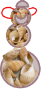
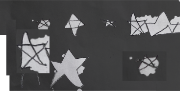
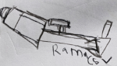

---

---

# This is SuiteCase 

## Welcome to my page

_Suitecase I lives in the cloud island in the sky._

_He found an island like the cloud island on the map called Hawaii._

_He took his SonicFlyer, (you might know this from the previous story)_

 **[SonicFlyer Info](https://ramacsv.github.io/SuitecaseGarden/),**
_and put it in the fly mode._

_He had to travel fast to reach before sunset._

_One special thing is he  built a special bridge to Hawaii from San Francisco._

_This bridge is flexible and expands so that the connecting points can be changed._

_On the bridge he has built a lot of places where he can stop to get food and fuel._

_It is satelite controlled_

_It has landing pad for his SonicFlyer and drive in area and ship docking station also._

_Suitecase has developed a very special fuel._    

_It is made out of salt water._

_It has Hydrogen and some secret mixture._

_This fuel makes it go long distance faster with less fuel and environment friendly._

_The stops on the bridge generate this fuel from sea water._

<b>Drwaing by ramacsv, SuiteCase Friend</b>

_When he reached the island, he found out it is called Oahu._ 

_He landed near a beach ._

_There he found a lot of coconut trees on a sandy mountain._

_He went up the mountain and found a puddle started swimming and reached a coconut tree near the edge._

_He went up the tree picked a coconut, opened it and drank the coconut water and ate the coconut._

_When he looked down he saw a dolphins dancing in  the ocean._

_He made friends with them and played in the waters._

_He wanted to take coconuts to his tree island._

_He asked dolphins help to load coconuts to his SonicFyer._

_Dolphins did not know what SonicFlyer was._

_They thought it was ocean's sonic wave sound._ 

_So they tried to dump coconut into ocean._

_Then he has explain to dolphins what SonicFlyer was._

_After that the dolphins loaded coconut properly._

_He picked up lot of plumerias and made lei's and put it on dolphins to thank them._

_It looked very nice on them._

<b>Drwaing by ramacsv, SuiteCase Friend</b>

### ================  Next part

_While walking along the beach he found some sea shells._

_He collected and thinking to do something with it._

_He got an idea. Using sand he made large medium and big balls using some glue he had_

_to hold the sand together._

_Stacked the balls and glued all around with the sea shells and decorated_

_He had sent a message to his friend cookie monster to send some carrots._

_Cookie monster put carrots inside a big inflatable ball and dropped of from his helicopter._

_Suitecase took the ball, deflated and took those carrots._

_Now the fun part is he stuck the carrots to the sand ball with shells_      

_and turned it into a sand shellman._

<b>Drwaing by ramacsv, SuiteCase Friend</b>

### ================  Next part

_It started getting dark. While walking along he srubled upon a huge telescope._

_Someone was looking through it. He was curious to find out what they were doing._

_He also looked through and found big moon, jupitor, saturn with rings._

<b>Drwaing by ramacsv, SuiteCase Friend</b>

_He also saw Vega star and took some pictures._

<b>Drwaing by ramacsv, SuiteCase Friend</b>

_It was getting really late, he then loaded his **SonicFlyer** with all he wanted to bring back._

_Turned on flying mode and sarted his flight back. Stopped on the bridge few times to eat and rest and recharge his SonicFlyer._

## **This is for now.**

*I will continue later in my next episode.*

## Thank you for visiting my page.

